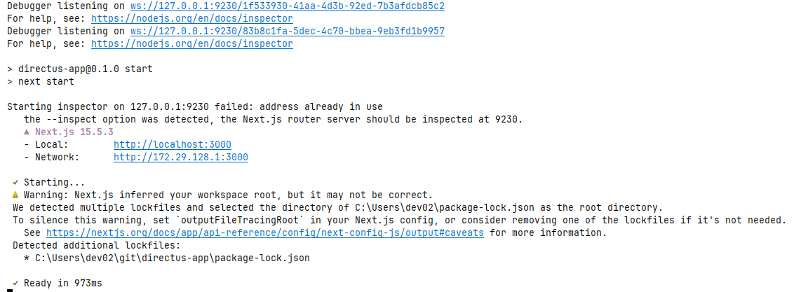
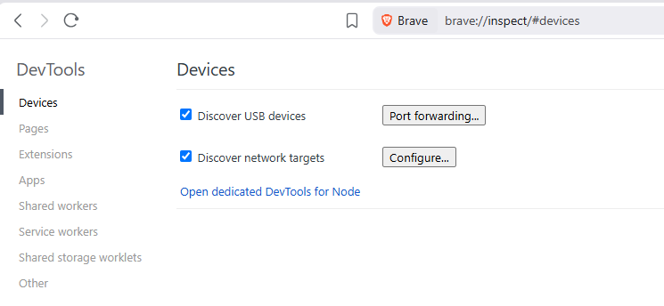
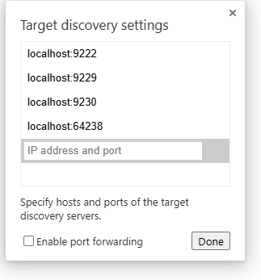
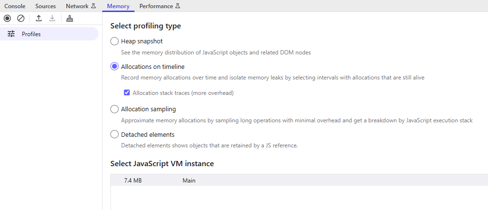
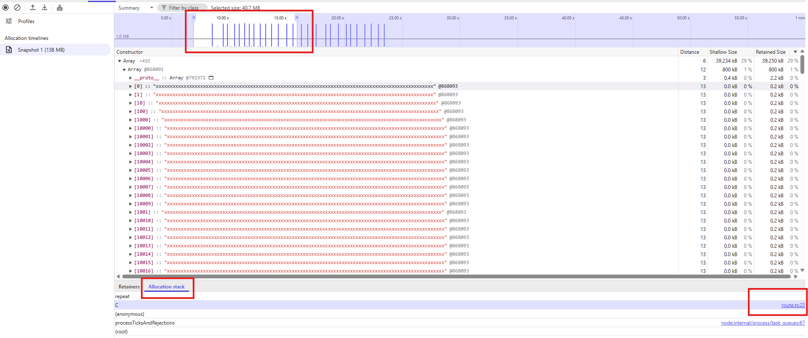

This is a [Next.js](https://nextjs.org) project bootstrapped with [`create-next-app`](https://nextjs.org/docs/app/api-reference/cli/create-next-app). to work with https://directus.io as a backend data service

## Getting Started

First, run the development server:

```bash

 npm run dev
 
# or

 pnpm dev
```

Open [http://localhost:3000](http://localhost:3000) with your browser to see the result.

You can start editing the page by modifying `app/page.tsx`. The page auto-updates as you edit the file.

This project uses [`next/font`](https://nextjs.org/docs/app/building-your-application/optimizing/fonts) to automatically optimize and load [Geist](https://vercel.com/font), a new font family for Vercel.


## Architecture and Deployment

### Architecture - https://directus.io vs Next.js


### Deployment 

- You should set up Directus on docker (docker-compose.yml) and copy file */database/data.db* to replace your data.db file and run Next.js app with ` npm run dev`

You could see the home page as below:


## Memory Profiling

### **Step 1: Start app**
- Run web app in local machine with command: ` $env:NODE_OPTIONS="--inspect=0"; npm run dev` OR with prod: `$env:NODE_OPTIONS="--inspect=0"; npm start`




### **Step 2: Open Inspect tool**
1. Open **Chrome** browser (or Edge)
2. In the address bar, type: `chrome://inspect`
3. Press Enter

You should see a page titled **"Devices"**




### **Step 3: Configure the Port (if needed)**

1. Click the **"Configure..."** button (near the top)
2. Make sure inspection listener port are in the list:
```
   localhost:9229
   localhost:9230
```
3. If the port is missing, add it
4. Click **"Done"**



Under **"Remote Target"** section, you should see:
```
Remote Target #LOCALHOST
  Target (v20.14.0)
  file:///.../directus-app/node_modules/next/dist/bin/next
  inspect
```
Click the **"inspect"** link under your Next.js process.

## 📊 **Step 4: Take Allocation Profile**

A new DevTools window will open. Now:

### **Allocation Instrumentation Timeline (Best for Finding Leaks)**

1. Click the **"Memory"** tab (at the top)
2. Select the radio button: **"Allocation instrumentation on timeline"**
3. Click the blue **"Start"** button at the bottom

Now the profiler is recording!



4. **Use your app** - Open another browser tab and move around the page:
`http://localhost:3000`

## 📊 **Step 5: Stop recording and Review results**

Wait for profiling completed and view report




## Learn More

To learn more about Next.js, take a look at the following resources:

- [Next.js Documentation](https://nextjs.org/docs) - learn about Next.js features and API.
- [Learn Next.js](https://nextjs.org/learn) - an interactive Next.js tutorial.

You can check out [the Next.js GitHub repository](https://github.com/vercel/next.js) - your feedback and contributions are welcome!